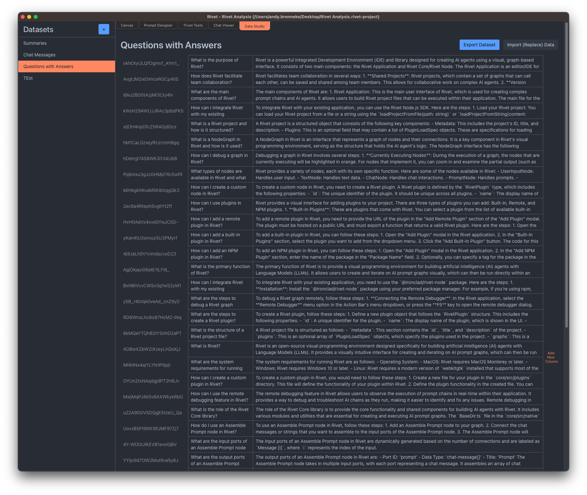

# Data Studio

The Data Studio in Rivet is your scratch pad for working with data and graphs. It is accessible by clicking the "Data Studio" tab at the top of Rivet.

## Datasets

The data in the data studio is organized into "datasets". Each dataset is isolated from the others, and can be used to store data for a specific purpose.

You can right click on a dataset to rename or delete it. Note that deleting cannot be undone at this time.

## Data

The data in each dataset is stored in a table. The organization of the table, and what columns are present and what they mean are entirely up to you. You can add, remove, and edit columns as you see fit.

Click "Add New Column" on the right or "Add New Row" at the bottom to add a new column or row. You may also right click on any cell in the table, and insert a column before or after it, or a row before or after the selected cell.

To edit a cell, double-click it. This will open up the editor for the cell. You can close the cell by clicking outside of it, or by pressing Cmd/Ctrl + Enter;

### IDs

Each row in the dataset has a unique ID. By default, these IDs are generated randomly. However, you can edit the IDs like any other cell. You can also specify an ID when using nodes like Append to Dataset. You can retrieve rows by their ID with the Get Dataset Row node.

### Embeddings

Each row can optionally have an embedding stored with it. This allows the dataset to work as a very simple vector database. Only one embedding can be stored with each row right now. You can then use the Dataset KNN node to find the nearest neighbors to a given row. This can be useful for testing RAG without having to set up a full database.

## Nodes

The following nodes in graphs can interact with datasets:

### Load Dataset Node

This node will load an entire dataset and output it as two output ports - the ID of the dataset, and the data of the dataset, minus the ID and the embedding. The data is organized as an array of arrays (`string[][]`). You can manipulate this using nodes like the Array node and Extract Object Path node.

### Append to Dataset Nodew

This node will append a row to a dataset. It takes in the data to append. The data should be an array of strings (`string[]`), but may
also be a single string. Values will be coerced into strings in the case of mixed values.

The dataset can be selected in the editor, or the ID can be passed in as an input port.

### Get All Datasets Node

This node will list all available datasets for a project. It lists the metadata for the datasets, so just their IDs and names. You can then use it with Load Dataset Node to get the data for a dataset.

### Dataset KNN Node

This node will find the nearest neighbors to a given row in a dataset. It takes in a vector, and a number of neighbors to find. It outputs the nearest rows to the given vector. Note that this outputs the full rows, including the ID and the embedding.

### Create Dataset Node

This node can be used in a graph to create a new empty dataset for an agent to work with. It takes in the name to give the dataset, and outputs the ID of the new dataset.

## Dataset Storage

The data for a dataset is stored in a `.rivet-data` file next to the `.rivet-project` file when a project is saved. When a project is loaded, and there is a `.rivet-data` file, the data will be loaded from that file.
